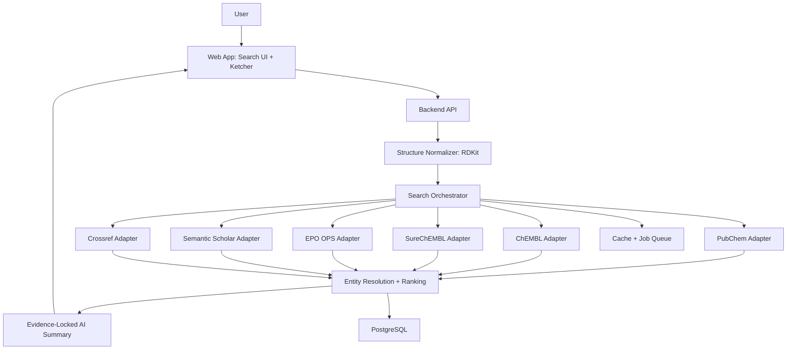

# 화학 구조 기반 특허/논문 검색 서비스 기획 및 상세 설계

> **[2026-06-11 스코프 변경 공지]**
>
> 2026-06-11부로 제품 스코프가 한 차례 **논문 전용(papers-only)** 으로 축소됐다가(D-010, `docs/chemical-search-progress/decision-log.md`), 같은 날 **SureChEMBL 특허 검색(논문과 분리 표시)** 까지 포함하도록 확장됐다 (D-014).
>
> - 결과 유형은 논문(Semantic Scholar/Crossref/OpenAlex)과 특허(SureChEMBL)로 나뉘며, 논문과 특허는 분리된 결과 섹션으로 표시한다.
> - EPO OPS와 ChEMBL 구조 검색(exact/similarity/substructure)은 계속 제외한다. Google Patents 통합 검색 링크(D-009)는 SureChEMBL이 제공하는 특허별 Google Patents 딥링크로 대체됐다.
> - 이 문서의 EPO OPS/구조검색 관련 내용은 과거 기획 기록으로만 유지하며 현재 구현 대상이 아니다.
> - 실제 API 계약은 snake_case JSON이며, 기준은 FastAPI `/docs`(OpenAPI)와 `src/lib/api.ts`다.

작성일: 2026-06-02
수정일: 2026-06-02
문서 목적: 화학식, 화합물명, SMILES/InChI, 직접 그린 구조를 입력받아 관련 특허와 논문을 찾는 웹 서비스의 가능 범위, 한계, MVP, 확장 설계를 개발 착수 가능한 수준으로 정리한다.

## 1. 결론

구현 가능하다. 다만 제품 범위를 명확히 나눠야 한다.

이 제품은 "화학 구조 검색 + 공개 특허/논문 데이터 조회 + 근거 기반 요약/랭킹" 도구로 정의한다. PubChem, ChEMBL, SureChEMBL, EPO OPS, Semantic Scholar, Crossref 같은 공개 API와 RDKit/Ketcher 같은 오픈소스 cheminformatics 도구를 조합하면 연구 보조용 MVP를 만들 수 있다.

하지만 SciFinder, Reaxys, Derwent, Minesoft ChemX 수준의 전문 화학 특허 검색을 공개 API만으로 대체할 수는 없다. 특히 Markush 구조, 청구항 범위 판단, 특허 명세서 이미지 구조 추출, novelty/FTO 법률 판단은 제품 범위 밖으로 둔다.

개발은 `POC -> MVP-1 -> MVP-2 -> Professional` 순서로 진행한다. 바로 전체 기능을 MVP에 넣으면 외부 API 검증, 구조 정규화, 후보 선택, 특허 검색 정확도, AI hallucination 방지까지 동시에 해결해야 해서 일정 리스크가 크다.

## 2. 제품 포지셔닝

### 2.1 제품 정의

- 공개 데이터 기반 화학 구조/문헌/특허 탐색 도구
- prior-art 후보 수집과 연구 문헌 탐색을 빠르게 돕는 도구
- 검색 결과마다 출처와 match evidence를 표시하는 도구
- AI는 검색 결과를 해석하고 정리하는 보조 기능으로만 사용

### 2.2 제품이 하지 않는 것

- 특허성, 침해, FTO, 무효 판단 단정
- Markush 구조의 법적 범위 해석
- 유료 전문 DB의 완전 대체
- 출처 없는 특허/논문 생성
- 비공개 R&D 정보를 외부 AI/API에 무조건 전송

## 3. 만들 수 있는 기능 범위

### 3.1 POC에서 가능한 기능

- SMILES 입력
- RDKit 구조 표준화
- PubChem CID/properties 조회
- ChEMBL exact/similarity/substructure 검색
- Semantic Scholar/Crossref 논문 후보 검색
- 결과를 간단한 JSON/Markdown으로 출력

### 3.2 MVP-1에서 가능한 기능

- 화학식 입력: 예) `C9H8O4`
- 화합물명 입력: 예) `aspirin`, 일반명 중심
- SMILES 입력: 예) `CC(=O)Oc1ccccc1C(=O)O`
- InChI/InChIKey 입력
- Ketcher 기반 웹 구조 그리기
- formula/name 입력 시 후보 선택 UI
- exact match 검색
- similarity 검색: Tanimoto threshold 기준
- substructure 검색
- PubChem/ChEMBL compound metadata 통합
- Semantic Scholar/Crossref 논문 메타데이터 검색
- 결과 중복 제거
- 근거 기반 관련성 점수
- CSV/Markdown export

### 3.3 MVP-2에서 가능한 기능

- SureChEMBL 기반 compound-patent association 검색
- EPO OPS 기반 patent family/bibliographic/legal 보강
- 특허 결과 카드와 evidence 표시
- AI 요약: evidence ID가 붙은 결과만 요약
- 검색 히스토리 저장
- provider별 cache/throttle/retry 정책

### 3.4 2차 확장 기능

- 구조 이미지 업로드 후 OSRA/DECIMER 계열 OCR로 SMILES 추출
- patent family 단위 그룹핑 고도화
- claim/abstract/description 내 compound mention 하이라이트
- 사용자 저장 목록, 프로젝트, 메모
- CAS RN, ChEMBL ID, PubChem CID, patent publication number 기반 역검색
- 구조 클러스터링
- citation graph, patent citation graph
- 검색 리포트 PDF 생성
- 외부 API 제공

### 3.5 공개 API만으로 어려운 기능

- Markush 구조 전체 검색 및 청구항 범위 해석
- 화학 특허 novelty/FTO 결론 자동 판정
- 유료 DB 수준의 전세계 특허 전문 구조 인덱스
- 모든 특허 PDF/이미지에서 구조 안정 추출
- CAS RN 공식 데이터 대량 연동
- Google Patents 자동 대량 크롤링 기반 제품화
- 법률 의견 수준의 특허 침해/무효 판단

## 4. 사용자와 사용 시나리오

### 4.1 주요 사용자

- 연구원: 특정 화합물/골격의 선행 논문과 특허 후보 확인
- 특허 담당자: prior-art 후보 수집과 1차 필터링
- 사업개발/기술조사 담당자: 특정 scaffold 관련 경쟁사 특허와 연구 동향 파악
- 학생/분석가: 공개 데이터 기반 문헌 탐색

### 4.2 핵심 시나리오

1. 사용자가 화학식 `C9H8O4`를 입력한다.
2. 시스템이 formula 후보를 PubChem/ChEMBL에서 찾는다.
3. 후보가 여러 개면 구조, 이름, 분자량, InChIKey를 보여주고 사용자가 하나를 선택한다.
4. 선택된 구조를 canonical SMILES/InChIKey로 표준화한다.
5. exact/similarity/substructure 검색을 실행한다.
6. 논문 후보는 Semantic Scholar/Crossref에서 찾는다.
7. 특허 후보는 MVP-2에서 SureChEMBL/EPO OPS로 보강한다.
8. 결과를 structure match, 문헌/특허 연관도, 최신성, citation 기준으로 정렬한다.
9. AI는 검색 결과와 evidence ID를 기반으로만 요약한다.

## 5. 입력 타입과 처리 전략

| 입력 타입 | 예시 | 처리 방식 | 정확도 | MVP 포함 |
|---|---|---|---|---|
| Molecular formula | `C9H8O4` | PubChem/ChEMBL 후보 검색 후 선택 | 낮음-중간 | MVP-1 |
| Common name | `aspirin` | PubChem name, ChEMBL search | 중간 | MVP-1 |
| IUPAC name | `2-acetoxybenzoic acid` | PubChem name lookup, OPSIN은 선택 | 중간 | best-effort |
| SMILES | `CC(=O)Oc1ccccc1C(=O)O` | RDKit canonicalization | 높음 | POC |
| InChIKey | `BSYNRYMUTXBXSQ-UHFFFAOYSA-N` | exact identifier lookup | 높음 | MVP-1 |
| 직접 그린 구조 | Ketcher output | molfile/SMILES 변환 | 높음 | MVP-1 |
| 구조 이미지 | PNG/PDF crop | OSRA/DECIMER OCR | 낮음-중간 | 제외 |

주의:

- 화학식은 구조를 특정하지 못한다. 후보 선택 UI가 필수다.
- IUPAC name은 PubChem으로 우선 처리하고, OPSIN은 Phase 0에서 도입 여부를 결정한다.
- salt/parent normalization, tautomer, stereochemistry 처리 정책은 검색 결과에 영향을 준다.

## 6. 검색 타입

### 6.1 Exact search

동일 구조 또는 동일 identifier 검색이다. InChIKey, canonical SMILES, PubChem CID, ChEMBL ID를 사용한다.

### 6.2 Formula search

분자식으로 후보 화합물을 찾는다. 단독 검색 결과를 최종 결과로 취급하지 않고, 사용자가 후보 구조를 선택한 뒤 다음 검색으로 넘어간다.

### 6.3 Similarity search

fingerprint 기반 Tanimoto similarity를 사용한다. 기본 threshold는 80%로 두고, 사용자가 70-95% 범위에서 조절할 수 있게 한다.

### 6.4 Substructure search

입력 구조가 타겟 화합물 내부에 포함되는지 검색한다. core scaffold 검색에 유용하다.

### 6.5 Superstructure search

타겟 구조가 입력 구조의 부분 구조인지 반대로 찾는다. MVP에서는 provider API 지원 범위 내에서만 제공하고, local index 기반 고속 검색은 확장 단계로 둔다.

## 7. 데이터 소스 설계

### 7.1 PubChem

용도:

- name/formula/SMILES/InChIKey 입력 정규화
- PubChem CID 조회
- compound properties 조회
- synonym, xref, safety, bioassay 보조 정보
- 구조 검색 API 활용

장점:

- 공개 compound coverage가 넓다.
- name/formula 기반 후보 검색에 유리하다.
- PUG REST API로 programmatic access 가능하다.

주의:

- structure search는 비동기 listkey 흐름이 필요할 수 있다.
- rate limit과 장시간 검색 처리 필요.
- compound-patent relevance가 전문 특허 DB만큼 직접적이지 않을 수 있다.

공식 문서: https://pubchem.ncbi.nlm.nih.gov/docs/pug-rest

### 7.2 ChEMBL

용도:

- bioactive molecule 검색
- similarity/substructure API
- molecule, activity, assay, target, document 연결
- 논문과 bioactivity 근거 연결

장점:

- 약물/바이오활성 화합물에 강하다.
- 구조 검색 API가 명확하다.
- activity/assay/target까지 확장 가능하다.

주의:

- 모든 화학 분야를 커버하지 않는다.
- 특허 연결은 SureChEMBL 또는 EPO OPS와 조합해야 한다.

공식 문서: https://chembl.gitbook.io/chembl-interface-documentation/web-services/chembl-data-web-services

### 7.3 SureChEMBL

용도:

- compound-patent association 검색
- 화학 특허 문서 corpus와 구조 annotation 활용
- compound repository와 patent document corpus 연결

MVP-2 조건:

- Phase 0에서 sample query 10개가 성공해야 한다.
- API 응답 스키마, rate limit, terms of use를 확인해야 한다.
- 응답이 불안정하면 MVP-2에서 제외하고 링크아웃 또는 수동 검토 보조로 낮춘다.

주의:

- patent full text/claim 분석은 추가 보강이 필요하다.
- SureChEMBL 결과는 "특허 후보"이지 법률 판단 결과가 아니다.

공식 API: https://www.api.surechembl.org/

### 7.4 EPO OPS

용도:

- patent bibliographic data
- worldwide legal event
- full-text and image database 기반 데이터
- patent family 보강
- publication/application metadata 조회

도입 조건:

- OAuth 등록과 quota 확인
- XML parsing spike 완료
- publication number 기반 보강 흐름 검증

주의:

- API key/OAuth 설정 필요.
- XML 파싱과 rate limiting 설계 필요.
- 화학 구조 검색 자체는 SureChEMBL/WIPO/PubChem과 조합하는 편이 낫다.

공식 문서: https://www.epo.org/en/searching-for-patents/data/web-services/ops

### 7.5 Semantic Scholar

용도:

- 논문 검색
- citation count
- abstract, authors, venue, year
- related paper discovery

주의:

- 화학 구조 직접 검색은 제공하지 않는다.
- compound name, synonym, InChIKey, ChEMBL/PubChem ID를 query term으로 변환해야 한다.
- API key 사용 여부와 rate limit을 Phase 0에서 확인한다.

공식 문서: https://www.semanticscholar.org/product/api

### 7.6 Crossref

용도:

- DOI metadata 조회
- title, abstract, journal, author, funder, license metadata
- DOI 기반 보강

주의:

- 화학 구조 검색 기능은 없다.
- abstracts는 일부 저작권 제한이 있을 수 있다.

공식 문서: https://www.crossref.org/documentation/retrieve-metadata/rest-api/

### 7.7 Ketcher

용도:

- 브라우저에서 화학 구조 그리기
- molfile/SMILES/InChI 계열 구조 입출력
- 구조 편집 UI

주의:

- query atom, Markush, polymer 등 고급 특허 구조 표현은 별도 검증 필요.

공식 저장소: https://github.com/epam/ketcher

### 7.8 RDKit / RDKit.js

용도:

- SMILES parsing/canonicalization
- molecular formula/molecular weight 계산
- fingerprint 생성
- similarity 계산
- substructure matching
- molecule rendering
- salt stripping/parent normalization

주의:

- 대규모 구조 검색은 local DB indexing 전략이 필요하다.
- 공개 API 검색과 local RDKit 검색의 결과 차이를 설명해야 한다.

공식 사이트: https://www.rdkit.org/

### 7.9 OPSIN

용도:

- IUPAC/systematic name을 구조로 변환

도입 방침:

- MVP-1에서는 PubChem name lookup을 우선한다.
- OPSIN은 Phase 0에서 설치/라이선스/정확도/운영 방식을 검증한 뒤 선택한다.
- OPSIN 미도입 시 IUPAC 입력은 best-effort로 표시한다.

## 8. 제품 요구사항

### 8.1 기능 요구사항

#### 검색 입력

- 텍스트 입력창: formula/name/SMILES/InChI/InChIKey 자동 감지
- 구조 그리기 탭: Ketcher editor
- 파일 업로드: mol/sdf 파일은 MVP-1 선택, 이미지 OCR은 제외
- 검색 모드 선택: exact, formula, similarity, substructure
- similarity threshold: 기본 80%, 70-95% 조절
- 데이터 소스 선택: POC/MVP 단계에 따라 노출 범위 제한

#### 결과 화면

- Compound candidates: 구조 이미지, 이름, formula, MW, PubChem CID, ChEMBL ID, InChIKey
- Patent results: title, publication number, application number, family ID, assignee, publication date, source, relevance reason
- Paper results: title, authors, venue, year, DOI, citation count, source, relevance reason
- Evidence panel: 어떤 identifier/synonym/structure match로 연결됐는지 표시
- AI summary: evidence ID가 있는 결과만 요약
- Export: CSV, JSON, Markdown report

#### 저장/협업

- MVP-1에서는 local/search history만 고려한다.
- saved searches, projects, shareable report URL은 Phase 2로 둔다.

### 8.2 비기능 요구사항

- cached query 응답: 3초 이내
- 외부 API live query: 10-30초 허용
- 장시간 검색: background job + progress UI
- API 장애 대응: partial results 표시
- provider별 queue/throttle/cache 적용
- 재현성: query, timestamp, source API version, raw response hash 저장
- 보안: API key server-side 보관
- 감사성: 결과별 source URL, retrieved_at, match method 표시

## 9. 시스템 아키텍처



## 10. 추천 기술 스택

### 10.1 POC 권장 스택

- Backend: Python FastAPI
- Cheminformatics: RDKit
- External APIs: PubChem, ChEMBL, Semantic Scholar, Crossref
- Storage: SQLite 또는 PostgreSQL
- Output: JSON/Markdown

### 10.2 MVP-1 권장 스택

- Frontend: Next.js, TypeScript, React
- Molecule editor: Ketcher
- Molecule rendering: backend-generated SVG 우선, RDKit.js는 선택
- Backend: Python FastAPI
- Cheminformatics: RDKit
- Worker: RQ 또는 FastAPI BackgroundTasks
- Database: PostgreSQL
- Cache: Redis
- Search index: PostgreSQL full-text
- Deployment: Docker Compose 기반 시작

### 10.3 MVP-2 이후

- EPO OPS OAuth integration
- SureChEMBL adapter
- OpenSearch
- PDF report generation
- organization/user management

## 11. 데이터 모델 초안

### 11.1 compounds

| 필드 | 타입 | 설명 |
|---|---|---|
| id | uuid | 내부 ID |
| canonical_smiles | text | canonical SMILES |
| input_smiles | text | 사용자 입력 원본 |
| inchi | text | InChI |
| inchikey | text | InChIKey |
| formula | text | molecular formula |
| molecular_weight | numeric | MW |
| pubchem_cid | text | PubChem CID |
| chembl_id | text | ChEMBL ID |
| names | jsonb | synonyms |
| structure_svg | text | 렌더링 결과 |
| normalization_warnings | jsonb | RDKit/정규화 경고 |
| created_at | timestamp | 생성일 |

### 11.2 searches

| 필드 | 타입 | 설명 |
|---|---|---|
| id | uuid | 검색 ID |
| user_id | uuid | 사용자 ID, MVP에서는 nullable |
| query_text | text | 원본 query |
| query_type | text | formula/name/smiles/inchi/drawn |
| search_mode | text | exact/similarity/substructure |
| threshold | integer | similarity threshold |
| status | text | pending/needs_candidate_selection/running/done/partial_failed/failed |
| normalized_compound_id | uuid | 표준화 compound |
| selected_candidate_id | uuid | 후보 선택 결과 |
| selected_sources | jsonb | 선택 소스 |
| source_diagnostics | jsonb | provider별 상태 |
| created_at | timestamp | 생성일 |

### 11.3 compound_candidates

| 필드 | 타입 | 설명 |
|---|---|---|
| id | uuid | 후보 ID |
| search_id | uuid | 검색 ID |
| compound_id | uuid | compound ID |
| source | text | PubChem/ChEMBL/etc |
| confidence | numeric | 후보 신뢰도 |
| display_name | text | 표시 이름 |
| evidence | jsonb | 후보 생성 근거 |

### 11.4 patents

| 필드 | 타입 | 설명 |
|---|---|---|
| id | uuid | 내부 ID |
| publication_number | text | 공개번호 |
| application_number | text | 출원번호 |
| family_id | text | patent family |
| title | text | 제목 |
| abstract | text | 초록, 저장 정책 필요 |
| assignees | jsonb | 출원인 |
| inventors | jsonb | 발명자 |
| publication_date | date | 공개일 |
| jurisdictions | jsonb | 국가/기관 |
| source | text | SureChEMBL/EPO/etc |
| source_url | text | 원문 링크 |
| raw_hash | text | 원본 응답 hash |
| raw | jsonb | 원본 응답, 저장 최소화 정책 적용 |

### 11.5 papers

| 필드 | 타입 | 설명 |
|---|---|---|
| id | uuid | 내부 ID |
| title | text | 제목 |
| doi | text | DOI |
| authors | jsonb | 저자 |
| venue | text | 저널/학회 |
| year | integer | 연도 |
| abstract | text | 초록, 저장 정책 필요 |
| citation_count | integer | 인용수 |
| semantic_scholar_id | text | S2 ID |
| source_url | text | 원문 링크 |
| raw_hash | text | 원본 응답 hash |
| raw | jsonb | 원본 응답, 저장 최소화 정책 적용 |

### 11.6 result_links

| 필드 | 타입 | 설명 |
|---|---|---|
| id | uuid | 링크 ID |
| search_id | uuid | 검색 ID |
| target_type | text | compound/patent/paper |
| target_id | uuid | 대상 ID |
| match_type | text | exact/similarity/substructure/name/synonym |
| score | numeric | 관련성 점수 |
| evidence | jsonb | 근거 |
| source | text | provider |

### 11.7 summary_claims

| 필드 | 타입 | 설명 |
|---|---|---|
| id | uuid | claim ID |
| search_id | uuid | 검색 ID |
| claim_text | text | AI가 생성한 문장 |
| claim_type | text | patent/paper/risk/next_step |
| evidence_ids | jsonb | 참조한 result_links IDs |
| confidence | text | low/medium/high |

## 12. API 설계 초안

### 12.1 Normalize

`POST /api/chem/normalize`

Request:

```json
{
  "input": "CC(=O)Oc1ccccc1C(=O)O",
  "inputType": "auto",
  "normalizationPolicy": {
    "stripSalts": true,
    "preserveStereochemistry": true
  }
}
```

Response:

```json
{
  "detectedType": "smiles",
  "canonicalSmiles": "CC(=O)Oc1ccccc1C(=O)O",
  "inchiKey": "BSYNRYMUTXBXSQ-UHFFFAOYSA-N",
  "formula": "C9H8O4",
  "molecularWeight": 180.16,
  "warnings": []
}
```

### 12.2 Search 생성

`POST /api/searches`

Request:

```json
{
  "query": "C9H8O4",
  "inputType": "formula",
  "mode": "similarity",
  "threshold": 80,
  "sources": ["pubchem", "chembl", "semantic_scholar", "crossref"]
}
```

Response, 후보 선택 필요:

```json
{
  "searchId": "uuid",
  "status": "needs_candidate_selection",
  "compoundCandidates": [
    {
      "candidateId": "uuid",
      "displayName": "Aspirin",
      "formula": "C9H8O4",
      "inchiKey": "BSYNRYMUTXBXSQ-UHFFFAOYSA-N",
      "source": "pubchem"
    }
  ]
}
```

Response, 바로 검색 가능:

```json
{
  "searchId": "uuid",
  "status": "running",
  "pollUrl": "/api/searches/uuid"
}
```

### 12.3 후보 선택

`POST /api/searches/{id}/select-compound`

Request:

```json
{
  "candidateId": "uuid"
}
```

Response:

```json
{
  "searchId": "uuid",
  "status": "running",
  "pollUrl": "/api/searches/uuid"
}
```

### 12.4 Search result

`GET /api/searches/{id}`

Response:

```json
{
  "status": "done",
  "normalizedCompound": {},
  "compoundCandidates": [],
  "patents": [],
  "papers": [],
  "summary": {
    "claims": [
      {
        "text": "핵심 논문 후보입니다.",
        "evidenceIds": ["result-link-uuid"],
        "confidence": "medium"
      }
    ]
  },
  "sourceDiagnostics": [
    {
      "source": "chembl",
      "status": "ok",
      "latencyMs": 420,
      "cached": false
    }
  ]
}
```

### 12.5 Export

`GET /api/searches/{id}/export?format=csv|json|markdown`

PDF export는 MVP-2 이후로 둔다.

## 13. Provider Adapter 계약

모든 외부 API client는 같은 adapter interface를 따른다.

### 13.1 공통 요청 컨텍스트

```json
{
  "searchId": "uuid",
  "compound": {
    "canonicalSmiles": "...",
    "inchiKey": "...",
    "formula": "...",
    "names": ["..."]
  },
  "mode": "exact|similarity|substructure",
  "threshold": 80,
  "timeoutMs": 10000
}
```

### 13.2 공통 응답

```json
{
  "source": "chembl",
  "status": "ok|partial|timeout|rate_limited|error",
  "items": [],
  "diagnostics": {
    "latencyMs": 1234,
    "cached": false,
    "retryCount": 0,
    "retrievedAt": "2026-06-02T00:00:00Z"
  }
}
```

### 13.3 provider별 정책

| Provider | MVP 단계 | Timeout | Cache TTL | Retry | 실패 처리 |
|---|---|---:|---:|---:|---|
| PubChem | POC | 10s | 7일 | 2회 | 후보 검색 실패 표시 |
| ChEMBL | POC | 10s | 7일 | 2회 | 해당 source partial |
| Semantic Scholar | POC | 10s | 3일 | 1회 | 논문 결과 partial |
| Crossref | POC | 10s | 7일 | 1회 | DOI 보강 skip |
| SureChEMBL | MVP-2 | 15s | 7일 | 1회 | 특허 결과 partial |
| EPO OPS | MVP-2 | 15s | 30일 | 1회 | patent metadata 보강 skip |

## 14. 검색 파이프라인 상세

### 14.1 입력 감지

1. InChIKey regex 검사
2. InChI prefix 검사
3. SMILES parse 시도
4. molecular formula regex 검사
5. 일반 name/IUPAC 처리
6. 실패 시 사용자에게 구조 직접 그리기 유도

### 14.2 구조 표준화

- RDKit Mol parse
- sanitize
- canonical SMILES 생성
- formula/MW 계산
- InChI/InChIKey 생성
- salt/parent normalization 옵션 제공
- stereochemistry preserve 여부 기록
- normalization warning을 결과에 노출

### 14.3 후보 생성

- Formula 입력: PubChem/ChEMBL 후보 목록 생성 후 사용자 선택
- Name 입력: PubChem/ChEMBL synonym 기반 exact 후보 생성
- SMILES/InChIKey 입력: exact 후보 생성

### 14.4 외부 검색

- PubChem: identifier/property/structure search
- ChEMBL: molecule/substructure/similarity/document/activity
- Semantic Scholar: compound name/synonym/InChIKey query
- Crossref: DOI/title 보강
- SureChEMBL: MVP-2에서 compound-patent association
- EPO OPS: MVP-2에서 publication number/family/legal/bibliographic 보강

### 14.5 병합과 중복 제거

- Compound: InChIKey 우선, 없으면 canonical SMILES + formula
- Patent: publication number 정규화, family ID 그룹핑
- Paper: DOI 우선, 없으면 title normalization + year + first author

### 14.6 랭킹

```text
score = structure_match_score
      + source_confidence
      + evidence_strength
      + recency_bonus
      + citation_or_family_bonus
      - ambiguity_penalty
```

예시 가중치:

| 항목 | 점수 |
|---|---:|
| exact InChIKey match | +50 |
| same first InChIKey block | +35 |
| similarity >= 90 | +30 |
| similarity 80-89 | +20 |
| substructure match | +25 |
| patent claim/abstract mention | +20 |
| title/abstract compound name mention | +10 |
| trusted source direct association | +20 |
| formula-only match | +5 |
| multiple isomer candidates | -15 |

### 14.7 AI 요약

AI는 검색을 대체하지 않고 결과 해석에만 사용한다.

생성 항목:

- 핵심 특허 후보
- 핵심 논문 후보
- 관련성 근거
- 검토 우선순위
- 불확실성/주의점
- 추가 검색 제안

강제 규칙:

- 모든 claim은 `evidenceIds`를 가져야 한다.
- evidence가 없는 claim은 저장하지 않는다.
- 법률 판단, 의학/안전성 결론, 출처 없는 특허/논문 생성은 금지한다.

## 15. UI 설계

### 15.1 화면 목록

1. Home/Search
2. Structure Editor
3. Candidate Selection
4. Results
5. Patent Detail, MVP-2
6. Paper Detail
7. Report Builder
8. Saved Searches, Phase 2
9. Settings/API Keys, Phase 2

### 15.2 Home/Search

- 상단 검색창
- 입력 타입 자동 감지 badge
- `Draw structure` 버튼
- 검색 모드 선택 tabs
- source checklist, MVP 단계별 제한
- advanced options 접기/펼치기

### 15.3 Candidate Selection

Formula/name 입력에서 후보가 여러 개일 때 필수로 사용한다.

표시:

- 구조 이미지
- preferred name
- formula/MW
- PubChem CID/ChEMBL ID
- InChIKey
- known synonyms
- source별 후보 confidence

### 15.4 Results

탭:

- Overview
- Compounds
- Papers
- Patents, MVP-2
- Evidence
- AI Summary, MVP-2

필터:

- match type
- year range
- source
- similarity range

## 16. 구현 단계

### Phase 0: 기술 검증, 3-5일

목표:

- RDKit 설치/구조 표준화 검증
- PubChem/ChEMBL API 샘플 호출
- Semantic Scholar/Crossref 샘플 검색
- SureChEMBL API 샘플 호출과 응답 스키마 확인
- EPO OPS 인증 가능성 확인
- Ketcher를 Next.js에 붙일 수 있는지 확인
- OPSIN 도입 여부 검토

산출물:

- API spike script
- sample input 10개 결과 비교표
- source별 rate limit/응답 형식 정리
- provider별 go/no-go 판정
- MVP-1 포함 source 확정

Go/no-go 기준:

| 항목 | 통과 기준 |
|---|---|
| RDKit | aspirin/caffeine/invalid SMILES 처리 성공 |
| PubChem | name/formula/SMILES lookup 성공 |
| ChEMBL | similarity/substructure query 성공 |
| Semantic Scholar | compound name query로 논문 후보 반환 |
| Crossref | DOI/title metadata 보강 성공 |
| SureChEMBL | compound-patent association sample 10개 중 7개 이상 유효 응답 |
| EPO OPS | OAuth/token 발급 및 publication lookup 성공 |
| Ketcher | 구조 입력 후 SMILES export 성공 |

### Phase 1: POC, 1-2주

범위:

- 텍스트 입력, SMILES/name/formula
- RDKit normalize
- PubChem/ChEMBL compound lookup
- ChEMBL similarity/substructure
- Semantic Scholar/Crossref paper lookup
- CLI 또는 단순 웹 화면
- JSON/Markdown 출력

제외:

- Ketcher
- SureChEMBL/EPO OPS
- AI summary
- 사용자 계정
- PDF export

### Phase 2: MVP-1, 3-5주

범위:

- Next.js 검색 UI
- Ketcher 구조 입력
- candidate selection UI
- PubChem/ChEMBL/Semantic Scholar/Crossref adapter 안정화
- 결과 병합/랭킹/evidence 표시
- CSV/Markdown export
- partial result 처리
- basic cache/throttle

제외:

- Markush 검색
- 법률 판단
- 조직/권한
- 결제
- 이미지 OCR

### Phase 3: MVP-2, 3-5주

범위:

- SureChEMBL patent lookup, Phase 0 통과 시
- EPO OPS patent metadata 보강, Phase 0 통과 시
- patent result card
- evidence-locked AI summary
- 검색 히스토리
- provider diagnostics dashboard

### Phase 4: Research workflow, 4-8주

범위:

- 사용자 계정
- saved searches/projects
- patent family grouping 고도화
- richer report builder
- background job queue
- 검색 결과 feedback loop

### Phase 5: Professional tier, 3개월 이상

범위:

- local structure index 구축
- bulk patent/literature ingestion
- OSRA/DECIMER image recognition
- OpenSearch/chemical fingerprint index
- enterprise audit logs
- 유료 데이터 provider 연동 검토
- advanced claim/evidence extraction

## 17. MVP 개발 태스크 분해

### Backend

- FastAPI 프로젝트 생성
- RDKit environment 구성
- `/chem/normalize` 구현
- PubChem client 구현
- ChEMBL client 구현
- Semantic Scholar client 구현
- Crossref client 구현
- provider adapter interface 구현
- provider response schema 정규화
- candidate selection state machine 구현
- search orchestrator 구현
- ranking 함수 구현
- export 구현
- SureChEMBL/EPO OPS는 MVP-2 태스크로 분리
- AI summary service는 MVP-2 태스크로 분리

### Frontend

- Search home
- input type detector 표시
- candidate selection UI
- results tabs
- paper result card
- evidence panel
- report export UI
- Ketcher integration, MVP-1
- patent result card, MVP-2
- AI summary panel, MVP-2

### Infrastructure

- PostgreSQL schema
- Redis cache
- background jobs
- API key config
- source-specific throttling
- Docker Compose
- logging/observability
- secret management policy

### QA

- aspirin test case
- caffeine test case
- formula ambiguity test case
- invalid SMILES test case
- no result test case
- provider timeout test case
- duplicate paper merge test case
- duplicate patent merge test case, MVP-2

## 18. 수용 기준

### 18.1 POC 완료 조건

- SMILES 입력으로 구조 표준화가 된다.
- PubChem 또는 ChEMBL에서 compound 후보를 가져온다.
- ChEMBL similarity/substructure 결과를 표시한다.
- Semantic Scholar 또는 Crossref에서 논문 후보를 표시한다.
- 결과에 source URL과 match reason이 있다.

### 18.2 MVP-1 완료 조건

- formula 입력 시 후보 선택이 가능하다.
- Ketcher에서 그린 구조로 검색할 수 있다.
- 후보 선택 후 검색 상태가 `running`으로 전환된다.
- 각 결과에 evidence가 표시된다.
- provider 장애 시 전체 검색이 실패하지 않고 partial result를 표시한다.
- CSV/Markdown export가 된다.
- 검색 결과가 같은 입력에 대해 재현 가능하다.

### 18.3 MVP-2 완료 조건

- 관련 특허 후보를 SureChEMBL 또는 다른 patent source에서 표시한다.
- EPO OPS 보강이 가능하면 patent metadata를 보강한다.
- AI 요약은 evidence ID가 있는 claim만 생성한다.
- source diagnostics가 UI에 표시된다.

## 19. 검색 품질 평가 기준

### 19.1 평가 데이터셋

Phase 0에서 최소 10개 compound를 선정한다.

- aspirin
- caffeine
- acetaminophen
- ibuprofen
- imatinib
- benzene
- glucose, formula ambiguity 확인용
- atorvastatin
- remdesivir
- 임의 invalid SMILES

### 19.2 정량 지표

| 지표 | 목표 |
|---|---:|
| normalize 성공률 | 유효 SMILES 기준 95% 이상 |
| formula 후보 표시 성공률 | 테스트 formula 기준 90% 이상 |
| ChEMBL top-10 관련 결과 확인률 | 테스트 compound 기준 70% 이상 |
| paper 중복 제거 정확도 | DOI 있는 결과 기준 95% 이상 |
| provider timeout 시 partial result 유지 | 100% |
| evidence 없는 AI claim 비율 | 0% |

### 19.3 정성 평가

- 결과가 왜 관련 있는지 사용자가 이해할 수 있는가?
- formula-only 결과를 과신하지 않도록 UI가 안내하는가?
- 특허 결과를 법률 판단처럼 보이게 하지 않는가?
- source별 실패/누락을 숨기지 않는가?

## 20. 리스크와 대응

| 리스크 | 영향 | 대응 |
|---|---|---|
| Formula ambiguity | 잘못된 후보 선택 | 후보 선택 UI와 `needs_candidate_selection` 상태 필수 |
| Provider rate limit | 검색 실패/지연 | provider별 cache, queue, throttle, timeout |
| SureChEMBL API 변동 | 특허 결과 불안정 | MVP-2로 분리, go/no-go 기준 적용 |
| EPO OPS 인증/쿼터 | 특허 보강 지연 | Phase 0에서 OAuth와 quota 확인 |
| Markush 미지원 | 전문 특허 검색 한계 | 명확한 disclaimer, 유료 DB 연동 옵션 |
| AI hallucination | 잘못된 특허/논문 제시 | evidence-locked summary, evidence 없는 claim 제거 |
| 구조 정규화 오류 | 검색 누락 | RDKit warnings 표시, 원본/정규화 구조 비교 |
| 저작권/라이선스 | 데이터 재배포 제한 | metadata 중심 저장, raw text 저장 최소화 |
| 법률 판단 오해 | 책임 리스크 | prior-art 후보 도구로 포지셔닝, 법률 자문 아님 명시 |
| 민감 R&D query 유출 | 보안/사업 리스크 | private mode, retention policy, 외부 AI 전송 제어 |

## 21. 보안/프라이버시/컴플라이언스

- 이 서비스는 prior-art 후보 탐색과 연구 보조 도구로 포지셔닝한다.
- 특허성, 침해, FTO, 무효 가능성에 대한 최종 판단을 제공하지 않는다.
- 출처별 terms of use를 준수한다.
- API key는 서버 측 secret store에만 저장한다.
- 사용자 검색 query는 민감 R&D 정보일 수 있다.
- private mode에서는 검색 query와 raw response를 장기 저장하지 않는다.
- 기본 retention policy를 명시한다. 예: 검색 로그 30일, export 파일 사용자 삭제 전까지, raw external response 7일 또는 hash만 보관.
- 외부 AI 요약 사용 시 compound query와 결과가 외부 provider로 전송되는지 명확히 고지한다.
- AI 요약 비활성화 옵션을 제공한다.
- 논문 abstract/full text는 저작권 제한이 있을 수 있으므로 원문 저장보다 metadata/link 중심으로 설계한다.
- 조직/권한 기능은 Phase 4 이후로 두되, 초기 schema는 user_id/tenant_id 확장 가능성을 남긴다.

## 22. 비용 구조

### 22.1 POC 비용

- 개발: 1명 기준 1-2주
- 서버: local/Docker 기준 거의 없음
- 외부 API: 무료/저비용 시작 가능
- AI 요약: 제외

### 22.2 MVP-1 비용

- 개발: 1명 기준 3-5주
- 서버: 소규모 MVP는 월 20-100 USD 수준 가능
- 외부 API: 대부분 무료/저비용 시작 가능
- AI 요약: 제외 또는 제한적 사용

### 22.3 MVP-2 비용

- 개발: 1명 기준 추가 3-5주
- EPO OPS는 사용량 조건 확인 필요
- AI 요약은 사용량 기반 비용 발생
- patent metadata 보강과 cache 저장소 비용 증가

### 22.4 비용 증가 요인

- 대량 검색
- full-text patent ingestion
- local chemical index 구축
- PDF/image OCR
- 유료 patent/chemistry provider 연동
- enterprise security 요구

## 23. 추천 우선순위

1. RDKit normalize
2. PubChem/ChEMBL compound 후보 검색
3. ChEMBL similarity/substructure
4. Semantic Scholar/Crossref paper lookup
5. Candidate selection API/UI
6. 결과 병합/랭킹/evidence 표시
7. Markdown/CSV export
8. Ketcher 구조 입력
9. SureChEMBL patent association
10. EPO OPS metadata 보강
11. Evidence-locked AI summary

이 순서가 적절한 이유는 구조 검색의 정확도와 데이터 출처 신뢰성을 먼저 확보해야 하기 때문이다. UI와 AI 요약을 먼저 만들면 데모는 빠르지만 검색 품질이 낮아진다.

## 24. 예시 사용자 플로우

### Aspirin 예시

입력:

```text
CC(=O)Oc1ccccc1C(=O)O
```

처리:

1. RDKit parse 성공
2. canonical SMILES/InChIKey 생성
3. PubChem CID 조회
4. ChEMBL exact/similarity/substructure 검색
5. Semantic Scholar query: `aspirin OR acetylsalicylic acid OR BSYNRYMUTXBXSQ-UHFFFAOYSA-N`
6. Crossref DOI metadata 보강
7. 논문 결과를 evidence와 함께 표시
8. MVP-2에서는 SureChEMBL patent association과 EPO OPS 보강을 추가

## 25. 오픈 이슈

- SureChEMBL API의 현재 rate limit과 endpoint 안정성 확인 필요
- WIPO PATENTSCOPE chemical structure search의 자동화/API 제공 범위 확인 필요
- EPO OPS OAuth 등록과 무료 quota 확인 필요
- PubChem structure search async listkey 구현 필요
- CAS RN 연동 여부 결정 필요
- OPSIN 도입 여부 결정 필요
- local chemical index를 어느 시점에 도입할지 결정 필요
- 유료 DB 연동 없이 어느 정도 특허 검색 품질을 목표로 할지 결정 필요
- 민감 query의 기본 보존 기간과 외부 AI 전송 정책 결정 필요

## 26. 참조 자료

- PubChem PUG REST: https://pubchem.ncbi.nlm.nih.gov/docs/pug-rest
- ChEMBL Data Web Services: https://chembl.gitbook.io/chembl-interface-documentation/web-services/chembl-data-web-services
- SureChEMBL API: https://www.api.surechembl.org/
- EPO Open Patent Services: https://www.epo.org/en/searching-for-patents/data/web-services/ops
- Semantic Scholar API: https://www.semanticscholar.org/product/api
- Crossref REST API: https://www.crossref.org/documentation/retrieve-metadata/rest-api/
- Ketcher: https://github.com/epam/ketcher
- RDKit: https://www.rdkit.org/
- OPSIN: https://github.com/dan2097/opsin

## 27. 다음 결정 필요사항

1. 첫 구현을 POC CLI/간단 웹으로 시작할지, 바로 Next.js UI까지 포함할지 결정한다.
2. 첫 타겟 분야를 정한다: 의약/바이오활성 화합물, 소재, 일반 유기화학 중 어디인지.
3. 특허 검색은 MVP-2로 두고, POC/MVP-1에서는 논문/compound 검색 품질에 집중할지 결정한다.
4. SureChEMBL과 EPO OPS를 Phase 0에서 통과하지 못하면 어떤 fallback을 쓸지 결정한다.
5. AI 요약을 MVP-2에 포함할지, 검색 품질 검증 후 Phase 4로 미룰지 결정한다.
6. 민감 R&D query의 저장/외부 전송 정책을 결정한다.