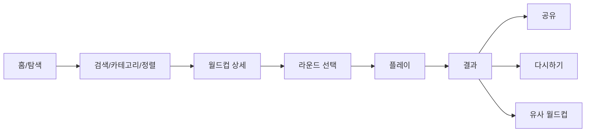
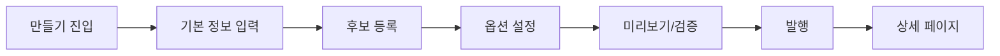
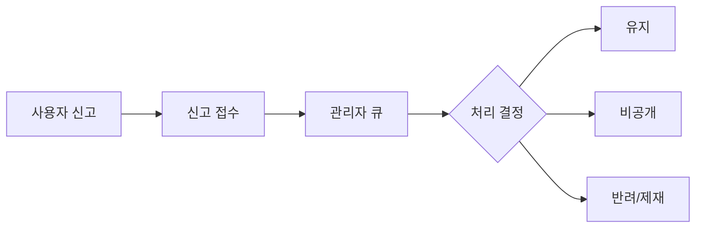

# 이상형 월드컵 MVP 기획 및 화면 IA/와이어프레임 목록

작성일: 2026-05-20  
기준 문서: `docs/ideal-worldcup-prd.md`  
범위: P0 MVP 실행 기획, 정보 구조, 화면 목록, 화면별 와이어프레임 구성

## 1. MVP 목표

MVP는 이상형 월드컵 서비스의 핵심 루프를 검증한다.

핵심 루프:
1. 사용자가 재미있어 보이는 월드컵을 찾는다.
2. 상세에서 후보 수와 라운드를 확인하고 시작한다.
3. 1:1 선택을 끝까지 완료한다.
4. 결과를 확인하고 공유한다.
5. 직접 월드컵을 만들어 발행한다.
6. 문제가 있는 콘텐츠는 신고되고 관리자가 처리한다.

MVP에서 검증할 질문:
- 사용자가 홈에서 10초 안에 플레이할 콘텐츠를 찾는가?
- 모바일에서 16강을 끝까지 완료하는가?
- 결과 공유 이미지가 실제 공유 행동을 만드는가?
- 비회원 제작이 충분히 낮은 진입 장벽을 제공하는가?
- 신고/관리자 플로우가 최소 운영 리스크를 감당하는가?

## 2. MVP 범위

### P0 포함

- 홈/탐색
- 월드컵 상세
- 라운드 선택
- 플레이
- 결과/랭킹
- 링크 복사 및 결과 공유 이미지
- 비회원 월드컵 제작
- 이미지 업로드
- 기본 검색/정렬/카테고리
- 신고 접수
- 관리자 신고 처리
- 이벤트 로깅
- 같은 브라우저 세션의 새로고침 복구

### P0 제외, P1로 분리

- 댓글
- 좋아요/저장
- 제작자 통계 대시보드
- 후보 대량 등록
- 친구 결과 비교 링크
- 급상승 정렬
- 고급 검색 품질 개선
- 계정 기반 이어하기/장기 임시 저장

## 3. MVP 사용자 플로우

### 3.1 플레이 플로우



### 3.2 제작 플로우



### 3.3 신고/관리자 플로우



## 4. IA

### 4.1 공개 사용자 영역

- `/`
  - 홈
- `/explore`
  - 탐색/검색 결과
- `/category/:slug`
  - 카테고리 목록
- `/worldcup/:slug`
  - 월드컵 상세
- `/worldcup/:slug/play`
  - 플레이
- `/worldcup/:slug/result/:sessionId`
  - 결과
- `/worldcup/new`
  - 월드컵 만들기
- `/worldcup/:slug/edit`
  - 비회원/제작자 수정
- `/report`
  - 신고 모달 또는 신고 제출 API

### 4.2 관리자 영역

- `/admin`
  - 관리자 홈
- `/admin/reports`
  - 신고 큐
- `/admin/worldcups/:id`
  - 콘텐츠 검토
- `/admin/media`
  - 미디어 검토

### 4.3 P1 이후 영역

- `/login`
- `/me`
- `/me/worldcups`
- `/me/saved`
- `/notifications`
- 댓글/좋아요/저장 관련 API와 UI

## 5. 내비게이션 구조

### 상단 글로벌 내비게이션

데스크톱:
- 로고
- 검색창
- 카테고리/탐색
- 월드컵 만들기
- 로그인 또는 임시 사용자 메뉴

모바일:
- 로고
- 검색 아이콘
- 만들기 버튼
- 메뉴 버튼

우선순위:
1. 검색
2. 만들기
3. 카테고리
4. 로그인

MVP에서는 로그인은 필수 플로우가 아니므로 시각적 우선순위를 낮춘다.

## 6. 화면 목록

| ID | 화면 | 경로 | P0 여부 | 목적 |
|---|---|---|---|---|
| S01 | 홈 | `/` | P0 | 인기 콘텐츠와 검색 진입 제공 |
| S02 | 탐색/검색 결과 | `/explore` | P0 | 검색, 정렬, 카테고리 탐색 |
| S03 | 카테고리 목록 | `/category/:slug` | P0 | 카테고리별 월드컵 탐색 |
| S04 | 월드컵 상세 | `/worldcup/:slug` | P0 | 시작 전 정보 확인과 라운드 선택 |
| S05 | 라운드 선택 모달/시트 | 상세 내부 | P0 | 플레이 규모 선택 |
| S06 | 플레이 | `/worldcup/:slug/play` | P0 | 1:1 선택 진행 |
| S07 | 결과 | `/worldcup/:slug/result/:sessionId` | P0 | 우승자, 내 결과, 공유 |
| S08 | 공유 이미지 생성 | 결과 내부 | P0 | 결과 공유 카드 생성/저장 |
| S09 | 만들기: 기본 정보 | `/worldcup/new` | P0 | 제목/설명/카테고리/비밀번호 입력 |
| S10 | 만들기: 후보 등록 | `/worldcup/new` | P0 | 후보 4명 이상 등록 |
| S11 | 만들기: 미리보기/발행 | `/worldcup/new` | P0 | 검증 후 공개 발행 |
| S12 | 수정 인증 | `/worldcup/:slug/edit` | P0 | 비회원 비밀번호 확인 |
| S13 | 신고 모달 | 모든 상세/결과 | P0 | 신고 사유 접수 |
| S14 | 관리자 신고 큐 | `/admin/reports` | P0 | 신고 처리 |
| S15 | 관리자 콘텐츠 검토 | `/admin/worldcups/:id` | P0 | 비공개/유지/제재 |
| S16 | 404/비공개/삭제 안내 | 공통 | P0 | 예외 상태 안내 |
| S17 | 서버 오류/로딩 실패 | 공통 | P0 | 장애 대응 안내 |

## 7. 화면별 와이어프레임

### S01. 홈

목적:
- 첫 방문자가 바로 플레이할 월드컵을 찾게 한다.
- 제작자는 만들기 CTA를 발견하게 한다.

구성:
- 헤더: 로고, 검색창, 만들기, 메뉴
- 대표 섹션: "지금 많이 하는 월드컵"
- 콘텐츠 카드 그리드
- 카테고리 칩
- 최신 월드컵 섹션
- 하단 푸터

카드 구성:
- 대표 후보 이미지 2장
- 제목
- 한 줄 설명
- 후보 수
- 플레이 수
- 완주율
- 업데이트일
- CTA: 시작, 상세

와이어프레임:

```text
[Logo] [검색어 입력________________] [만들기] [메뉴]

지금 많이 하는 월드컵
[카드][카드][카드][카드]

카테고리
[아이돌] [음식] [게임] [애니] [스포츠] [여행] [...]

최신 월드컵
[카드][카드][카드][카드]

[Footer]
```

상태:
- 로딩 스켈레톤
- 콘텐츠 없음
- 검색어 없음
- 이미지 로딩 실패

### S02. 탐색/검색 결과

목적:
- 검색어, 카테고리, 정렬로 원하는 월드컵을 찾는다.

구성:
- 검색창
- 카테고리 필터
- 정렬: 인기순, 최신순, 완주율순
- 기간 필터: 전체, 오늘, 주간, 월간
- 카드 목록
- 페이지네이션 또는 더보기

와이어프레임:

```text
[검색어____________________] [검색]

[전체] [아이돌] [음식] [게임] [애니] ...
[인기순 v] [전체 기간 v]

검색 결과 128개
[카드][카드][카드]
[카드][카드][카드]

[더보기]
```

P1:
- 급상승 정렬
- 댓글순
- 고급 태그 추천

### S03. 카테고리 목록

목적:
- 검색 없이 주제별 콘텐츠를 훑는다.

구성:
- 카테고리명
- 설명
- 하위 카테고리/태그
- 인기순/최신순/완주율순
- 카드 그리드

와이어프레임:

```text
아이돌/연예
아이돌, 배우, 방송인 관련 월드컵

[남자 아이돌] [여자 아이돌] [배우] [스트리머]

[인기순 v]
[카드][카드][카드]
```

### S04. 월드컵 상세

목적:
- 사용자가 시작 전에 월드컵의 내용과 품질을 판단하게 한다.
- 첫 화면에서 시작 CTA를 제공한다.

구성:
- 대표 후보 이미지 2장
- 제목
- 설명
- 제작자
- 후보 수, 플레이 수, 완주율, 업데이트일
- 라운드 선택 또는 시작 CTA
- 후보 미리보기
- 종합 랭킹 Top 5
- 신고/공유
- 유사 월드컵

와이어프레임:

```text
[대표 이미지 A][대표 이미지 B]

제목
설명 텍스트
후보 64개 · 플레이 12,340 · 완주율 62% · 업데이트 2026.05.20

[16강 v] [지금 시작하기]
[공유] [신고]

후보 미리보기
[후보][후보][후보][후보] [더보기]

종합 랭킹
1. 후보명 32%
2. 후보명 21%

이런 월드컵은 어때요?
[카드][카드][카드]
```

상태:
- 비공개 콘텐츠
- 삭제된 콘텐츠
- 신고로 제한된 콘텐츠
- 후보 부족

P1:
- 댓글
- 좋아요/저장

### S05. 라운드 선택 모달/하단 시트

목적:
- 플레이 전 라운드 규모를 명확하게 선택한다.

구성:
- 월드컵 제목
- 전체 후보 수
- 선택 가능한 라운드 버튼
- 예상 소요 시간
- 랜덤 샘플링 안내
- 시작 버튼

와이어프레임:

```text
라운드 선택
총 46개 후보 중 선택한 라운드 수만큼 무작위 참여합니다.

[결승] [4강] [8강] [16강] [32강]

예상 소요 시간: 약 5분
[시작하기]
```

규칙:
- 후보 수보다 큰 라운드는 비활성화한다.
- 전체 후보 모드가 켜진 월드컵은 부전승 안내를 표시한다.

### S06. 플레이

목적:
- 사용자가 후보를 빠르고 몰입감 있게 선택한다.

구성:
- 상단 바: 나가기, 제목, 라운드/경기, 진행률
- 좌측 후보
- VS 영역
- 우측 후보
- 키보드 안내
- 현재 라운드 큐
- 탈락자 요약

와이어프레임:

```text
[나가기] 월드컵 제목                         16강 1/8  [진행률 12%]

┌────────────────────┐   VS   ┌────────────────────┐
│                    │        │                    │
│     후보 이미지     │        │     후보 이미지     │
│                    │        │                    │
│ 후보명             │        │ 후보명             │
│ 설명               │        │ 설명               │
└────────────────────┘        └────────────────────┘

← / → 로 선택 가능

이번 라운드
[NOW 1경기] [2경기 미정] [3경기 미정] ...
탈락자: 아직 없음
```

모바일:
- 후보는 상하 배치보다 좌우 스와이프/탭을 우선 검토한다.
- 화면 높이가 부족하면 큐/탈락자는 접힘 패널로 둔다.
- 선택 버튼은 이미지 전체에 적용한다.

상태:
- 이미지 로딩 중
- 이미지 실패
- 네트워크 지연
- 중복 클릭 방지
- 새로고침 복구

### S07. 결과

목적:
- 우승자를 강조하고 공유를 유도한다.

구성:
- 우승자 이미지
- 우승자 이름
- 전체 랭킹 대비
- 내 선택 경로
- 공유 CTA
- 다시하기
- 다른 라운드로 다시하기
- 유사 월드컵 추천

와이어프레임:

```text
우승 결과

[우승자 이미지]
우승자명
전체 랭킹 3위 · 승률 58%

[결과 이미지 저장] [링크 복사]
[다시하기] [다른 라운드]

내 선택 경로
16강 > 8강 > 4강 > 결승

비슷한 월드컵
[카드][카드][카드]
```

P1:
- 친구와 결과 비교
- 댓글 작성

### S08. 공유 이미지 생성

목적:
- 결과를 SNS/메신저에 바로 공유할 수 있게 한다.

구성:
- 공유 카드 미리보기
- 비율 선택: 정사각형, 스토리형, 가로형
- 저장
- 링크 복사

와이어프레임:

```text
공유 이미지

[미리보기 카드]

[정사각형] [스토리] [가로]
[이미지 저장] [링크 복사]
```

공유 카드 정보:
- 서비스 로고
- 월드컵 제목
- 우승자 이미지
- 우승자명
- 짧은 결과 문구
- QR 또는 짧은 URL

### S09. 만들기: 기본 정보

목적:
- 비회원도 빠르게 월드컵 기본 정보를 입력한다.

구성:
- 제목
- 설명
- 카테고리
- 태그
- 공개/비공개
- 민감 콘텐츠 여부
- 수정/삭제 비밀번호
- 비밀번호 확인
- 다음 버튼

와이어프레임:

```text
월드컵 만들기
[기본 정보] [후보 등록] [미리보기]

제목 *
[________________]

설명
[________________________]

카테고리 *
[선택 v]

태그
[태그 입력________] [+]

[ ] 성인/민감 콘텐츠 포함

수정/삭제 비밀번호 *
[________]
비밀번호 확인 *
[________]

[다음: 후보 등록]
```

검증:
- 제목 필수
- 비밀번호 필수
- 비밀번호 확인 일치
- 금칙어/스크립트 차단

### S10. 만들기: 후보 등록

목적:
- 최소 4명 이상의 후보를 등록한다.

구성:
- 후보 추가 카드
- 이미지 업로드
- 후보명
- 설명
- 미디어 URL
- 후보 목록
- 중복/오류 안내

와이어프레임:

```text
후보 등록
최소 4명 이상 등록하세요.

[+ 후보 추가]

후보 1
[이미지 업로드]
후보명 * [____________]
설명     [____________]
미디어 URL [__________]

후보 목록
[썸네일] 후보명 [수정] [삭제]
[썸네일] 후보명 [수정] [삭제]

[이전] [다음: 미리보기]
```

P1:
- 대량 등록
- CSV/TSV
- 파일명 자동 후보명

### S11. 만들기: 미리보기/발행

목적:
- 발행 전 실제 상세/플레이 상태를 확인한다.

구성:
- 유효성 검사 결과
- 대표 이미지 미리보기
- 가능한 라운드
- 샘플 매치 미리보기
- 발행 버튼

와이어프레임:

```text
미리보기

검증 결과
[정상] 제목
[정상] 후보 8명
[정상] 비밀번호

상세 미리보기
[대표 이미지 A][대표 이미지 B]
제목 / 설명

플레이 미리보기
[후보 A] VS [후보 B]

[이전] [발행하기]
```

발행 후:
- 상세 페이지로 이동
- 링크 복사 토스트

### S12. 수정 인증

목적:
- 비회원 제작자가 비밀번호로 수정/삭제에 접근한다.

구성:
- 월드컵 제목
- 비밀번호 입력
- 확인
- 비밀번호 분실 안내

와이어프레임:

```text
월드컵 수정
이 월드컵을 수정하려면 제작 시 입력한 비밀번호가 필요합니다.

비밀번호
[________]

[확인]

비밀번호를 잊었다면 비회원 콘텐츠는 복구가 어렵습니다.
```

### S13. 신고 모달

목적:
- 부적절한 콘텐츠를 구조화된 사유로 신고한다.

구성:
- 신고 대상 표시
- 신고 사유
- 상세 설명
- 제출

와이어프레임:

```text
신고하기
대상: 월드컵 / 후보 / 결과

사유
( ) 저작권/초상권
( ) 성인/선정성
( ) 혐오/차별
( ) 개인정보
( ) 스팸
( ) 기타

상세 내용
[________________________]

[취소] [신고 제출]
```

### S14. 관리자 신고 큐

목적:
- 접수된 신고를 빠르게 분류하고 처리한다.

구성:
- 신고 목록
- 상태 필터
- 사유 필터
- 대상 미리보기
- 처리 액션

와이어프레임:

```text
관리자 > 신고 큐

[대기] [처리중] [완료]   [사유 v]

신고 목록
ID | 대상 | 사유 | 신고 수 | 접수일 | 상태 | 액션
01 | 월드컵 A | 저작권 | 3 | ... | 대기 | [검토]
```

### S15. 관리자 콘텐츠 검토

목적:
- 신고 대상 콘텐츠의 상태를 결정한다.

구성:
- 콘텐츠 상세
- 신고 내역
- 이미지/후보 목록
- 처리 메모
- 유지/비공개/삭제/제재

와이어프레임:

```text
콘텐츠 검토

월드컵 제목
제작자 / 생성일 / 플레이 수

[대표 이미지]
후보 목록

신고 내역
- 저작권 3건
- 개인정보 1건

처리 메모
[________________]

[유지] [비공개] [삭제] [제작자 제한]
```

### S16. 404/비공개/삭제 안내

목적:
- 접근 불가 상태를 명확히 안내하고 탐색으로 복귀시킨다.

구성:
- 상태 메시지
- 사유
- 홈/탐색 이동

와이어프레임:

```text
콘텐츠를 볼 수 없습니다
삭제되었거나 비공개 처리된 월드컵입니다.

[홈으로] [다른 월드컵 보기]
```

### S17. 서버 오류/로딩 실패

목적:
- 실패 상황에서도 사용자가 재시도할 수 있게 한다.

구성:
- 오류 메시지
- 재시도
- 홈 이동
- 문의/신고

와이어프레임:

```text
일시적으로 불러오지 못했습니다
네트워크 상태를 확인하거나 다시 시도해 주세요.

[다시 시도] [홈으로]
```

## 8. 컴포넌트 목록

### 공통

- Header
- SearchBar
- CategoryTabs
- SortSelect
- WorldCupCard
- CandidateImage
- EmptyState
- LoadingSkeleton
- ErrorState
- ConfirmDialog
- BottomSheet
- Toast

### 월드컵

- RoundSelector
- CandidatePreviewGrid
- RankingSummary
- PlayHeader
- MatchOptionCard
- MatchQueue
- EliminatedList
- ResultHero
- ShareCardPreview

### 제작

- CreateStepper
- BasicInfoForm
- CandidateForm
- CandidateList
- ValidationSummary
- PublishPreview
- PasswordGate

### 관리자

- ReportTable
- ReportFilter
- ContentReviewPanel
- ModerationActionBar

## 9. 상태/예외 정의

| 상태 | 발생 위치 | 처리 |
|---|---|---|
| 콘텐츠 없음 | 홈/탐색/카테고리 | 추천 카테고리와 만들기 CTA 표시 |
| 검색 결과 없음 | 탐색 | 검색어 수정, 인기 콘텐츠 추천 |
| 후보 부족 | 상세/플레이 | 시작 비활성화, 제작자 수정 안내 |
| 이미지 실패 | 카드/상세/플레이 | 대체 이미지와 후보명 표시 |
| 비공개/삭제 | 상세/플레이 | 안내 화면으로 전환 |
| 신고 처리됨 | 상세/탐색 | 노출 제외 또는 제한 안내 |
| 세션 만료 | 플레이 | 새로 시작 안내 |
| 네트워크 실패 | 전체 | 재시도 버튼 |
| 중복 클릭 | 플레이 | 다음 매치 전환 중 입력 잠금 |

## 10. MVP 이벤트 로깅 매핑

| 화면 | 이벤트 |
|---|---|
| S01/S02/S03 | search_submit, category_click, card_click |
| S04 | worldcup_view, round_select_open, play_start_click, report_open |
| S05 | round_select, play_start |
| S06 | match_select, play_exit, session_restore |
| S07 | play_complete, retry_click, related_click |
| S08 | share_click, share_image_download |
| S09/S10/S11 | create_start, candidate_add, validation_error, create_publish |
| S13 | report_submit |
| S14/S15 | report_review, moderation_action |

## 11. 우선순위

### 1차 디자인/개발

1. S01 홈
2. S04 상세
3. S05 라운드 선택
4. S06 플레이
5. S07 결과
6. S08 공유 이미지

### 2차 디자인/개발

1. S09 만들기 기본 정보
2. S10 후보 등록
3. S11 미리보기/발행
4. S12 수정 인증

### 3차 디자인/개발

1. S13 신고 모달
2. S14 관리자 신고 큐
3. S15 관리자 콘텐츠 검토
4. S16/S17 예외 화면

## 12. 와이어프레임 제작 기준

- 모바일 390px, 데스크톱 1440px 기준으로 우선 설계한다.
- 플레이 화면은 모바일에서 버튼/이미지 터치 영역을 최소 44px 이상으로 둔다.
- 카드 제목은 2줄까지 노출하고 이후 말줄임 처리한다.
- 후보명은 플레이 화면에서 2줄까지 허용한다.
- CTA 문구는 "시작하기", "결과 공유", "월드컵 만들기"처럼 행동 중심으로 쓴다.
- P1 기능은 와이어프레임에서 회색 비활성 또는 별도 주석으로만 표시한다.
- 광고 영역은 P0 디자인에서 플레이 화면에 포함하지 않는다.

## 13. 다음 산출물 제안

이 문서 다음에는 아래 순서로 만들면 된다.

1. 화면별 상세 기능 명세
2. API 초안
3. DB 스키마 상세
4. 디자인 시스템 초안
5. 실제 저충실도 와이어프레임 이미지 또는 Figma 프레임
